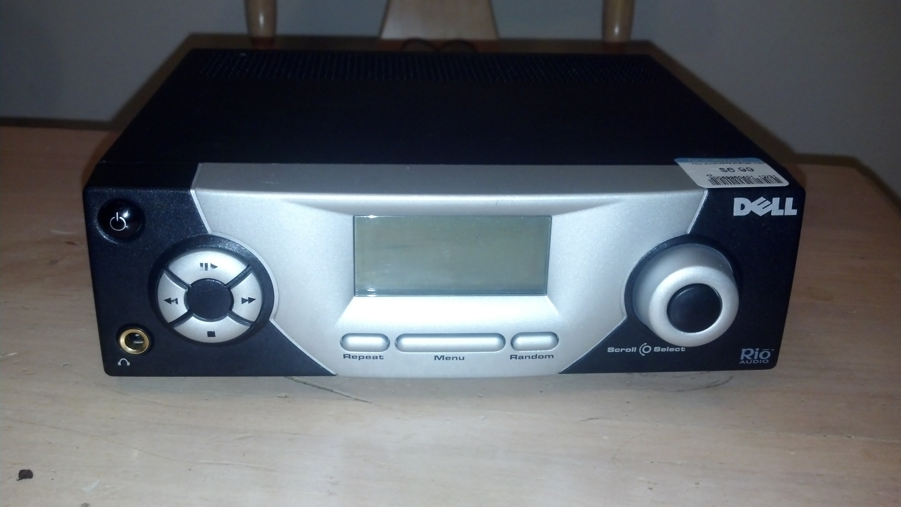

title: Rio Receiver to Wireless Kitchen Stereo
date: 2014-01-05 20:53:41.143241

**Edit:** *It seems that the site/software I used when I wrote this post is no
longer hosted at the listed URL. I don't remember the specifics of how
everything worked, but since it looks like the code was licensed under the GPL,
I'll re-host it here:*
<center>[Firmware Download](assets/rio_recv.zip "Slimrio Firmware")</center>
<center>[Documentation on Wayback Machine](https://web.archive.org/web/20110810013823/http://empeg.org.uk/slimrio/index.html "slimrio")</center>

At a recent thrift store run, I came across an interesting looking piece of
equipment- the front looked like a car stereo, but on the back, there were
audio outs and an Ethernet port. Figuring this could turn in to something
useful, I grabbed it with a set of speakers for $7.



 The Dell/Rio Receiver was a home stereo that acted as a network MP3 player. It
 was released in 2001 at a price point of $350. Inside, it boasts a 74MHz ARMv7
 CPU, 512kb of flash memory, and 4MB of RAM, along with a 10W audio amplifier.
 With 512kb of flash and no other option to attach storage, there wouldn't be
 much room to work with for loading an OS if it weren't for the creative boot
 method. First, the device boots a modified Linux kernel from flash. It then
 grabs an IP address via DHCP and uses SSDP to discover an NFS share containing
 a new kernel, which it loads. The new kernel then mounts the NFS share, which
 by default contained client software and a media player. Thus, the receiver
 must be used in conjunction with a computer running the appropriate server
 software from Dell, which, though still available, is limited to serving mp3,
 wmv, and wav files through a very ugly interface.

Something this cool must be capable of so much more than serving up my
collection of Disney mp3's, and I had all sorts of plans crafted to compile my
own kernel and figure out how to stream Pandora to it. Fortunately, a little
research saved me a lot of work- I found a [similar
project](http://empeg.org.uk/slimrio/index.html) from 7 years ago that turns
the Rio Receiver into a
[Squeezebox](http://www.logitech.com/en-us/support/squeezebox-radio-black
"Squeezebox")-compatible device. It's essentially the same idea as the original
software- a server streams music to the device- but Squeezebox is much more
advanced. Not only does it allow streaming of local audio files, it can also
stream thousands of internet radio stations and has dozens of plugins for
online streaming services - Pandora included. Also, it's managed through a very
professional-looking and easy-to-use web interface.

I set up a static IP for the receiver, set up the NFS share with the new kernel
on my desktop, and used [this python
script](http://empeg.org.uk/slimrio/source/ssdp.py) for the SSDP advertising.
Unfortunately, the device just sat at the "Initializing" screen, even though I
could see it was receiving from the SSDP script. I fired up
[Wireshark](https://www.wireshark.org/ "Wireshark") to see exactly what was
going in the exchange:

[](assets/wireshark_bad.jpg)

It turns out that NFSv2 was disabled on my system:  

```bash
$ cat /proc/fs/nfsd/versions
-2 +3 +4 +4.1 -4.2
$ uname -r
3.12.6-1-ARCH
```

After searching Google and trying a few different tricks, I was able to get
NFSv2 working by making the following change to /etc/conf.d/nfs-server.conf:

```bash
# Options to pass to rpc.nfsd.
# See rpc.nfsd(8) for more details.
NFSD_OPTS="-V 2"
```

And after restarting the nfs daemon:

```bash
$ cat /proc/fs/nfsd/versions
+2 +3 +4 +4.1 -4.2
```

I fired up Wireshark and turned the receiver on again. This time, things were a
lot more interesting:

[")](assets/wireshark_working.jpg)


Great success! The receiver now boots into the custom kernel and reaches out to
the local network searching for a Squeezebox server. Though I believe there are
other (more free) options, I used Logitech's Media Server software, which is
free to download/use and is surprisingly open source. It also allows access to
their suite of plugins as well as localized radio and information.

First things first- let's test it out:

<video width=100% controls='controls' preload='auto' style='background:black;'>
    <source src='assets/riovid_1.mp4' type='video/mp4'>
    <source src='assets/riovid_1.ogg' type='video/ogg'>
    **Your browser doesn't support this video!**
</video>


Looking good. I made sure I could stream mp3s from my machine and that Pandora
worked (which it did... awesome!). The plan is to put this thing in the kitchen
so I can jam out while I cook, but wires running all over the place may create
a hazardous twerking environment and the last thing I need is to be rushed to
the ER wearing my Miley outfit. To make this work, I'll have to go wireless.


Another thrift store find at $3... I paid $60 for one of these 3 years ago...
the Linksys WRT160N v3. I loaded up [dd-wrt](http://www.dd-wrt.com) on it and
set it up as a WiFi access point, configuring it to my home wireless network
settings. The router states that it requires a 12V power supply at 500mA for
operation, and luckily, the internal power supply for the Rio Receiver outputs
12V (and is hopefully beefy enough to supply an extra 500mA...at least it's
fused). To make things easy, I chopped off the end of an old DC adapter and
wired it in to the 12V on the supply. I took the router out of it's shell so
that I could fit it inside the receiver's case. I tested before I closed things
up:


It may be overkill, but it's cheap, simple, and it works. 

Finally, I put everything together on the kitchen counter. Somehow, I only own
2 Ethernet cables and both are in constant use, so I wasn't able to make this
permanent. I'm going to find a smaller cable - 12 inches or so - and drill a
hole in the receiver's case to run the cable from the Ethernet port to the
(now) internal router.


And of course, a video (the sound part-way through is my phone crying to be plugged in):
<video width=100% controls='controls' preload='auto' style='background:black;'>
    <source src='assets/riovid_2.mp4' type='video/mp4'>
    <source src='assets/riovid_2.ogg' type='video/ogg'>
    **Your browser doesn't support this video!**
</video>

## Conclusion

The Rio Receiver is pretty neat piece of equipment, though it blows my mind
that there are people that paid $350 for it (albeit 13 years ago). Nowadays, a
Raspberry Pi operates is an order of magnitude more powerful and 1/10th the
cost. It definitely makes creative use of the hardware readily available at the
time, especially with the double-boot process allowing for updates without
reflashing the device. The ability to use the Squeezebox suite really showcases
the receiver's potential and adding wireless networking capability makes it
much more useful.

## References

* [Wikipedia - Rio Receiver](https://en.wikipedia.org/wiki/Rio_Receiver)
* [slimrio - SLIMP3 emulation for the Rio Receiver](http://empeg.org.uk/slimrio/index.html)
* [Hacking the Rio Receiver](http://www.graflex.org/klotz/rio/rioserve_0_20b-llk/README.html)
* [Logitech - mysqueezebox.com](http://www.mysqueezebox.com)

