date: 2016-09-10 22:08:44.812027
tags: ''
title: 'Sous-vide on the Cheap: Slow Cooker Conversion'

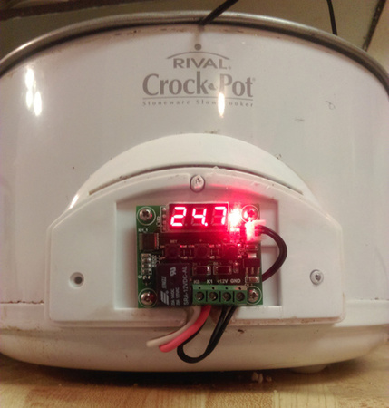

About a month ago, I ordered a handful of [W1209] temperature controllers on
eBay for about $2 a piece. I figured that if they actually work, it's a really
good deal- I know I can't build something similar for less than that price.

Something about ordering eBay electronics from China is enjoyable in an odd
sort of way for me. There's all these neat little breakout boards and modules,
most loaded with counterfeit components and ripped-off designs. The shipping
estimates are hilarious- "Your item will arrive in 2 to 12 weeks". It's like
I can't quite believe it's a real thing until a something that I've forgotten 
that I've ordered shows up at my door.

This week, the temperature controllers that I'd forgotten about were delivered.
After some examination and probing around, I decided they were good enough to 
put to the test with a rudimentary sous-vide set up. 

## Parts

### [W1209] Temperature Controller

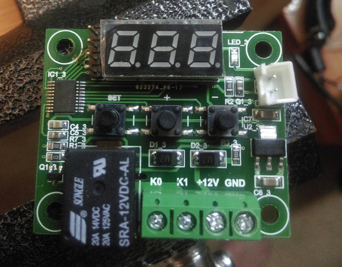

The controller could easily have its own post, and will as soon as I have
some time to put in to it. The setup is pretty straight-forward; a sealed 
probe on about 1.5' of wire, a 3x7 segment display, a couple buttons, some
screw terminals, a microcontroller, and a relay.

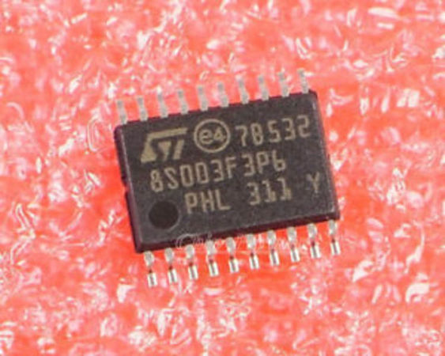

The microcontroller is an
STM8S003F3, from STM's 'value' line (really... they're $0.28 in quantity), 
and is comparable to Atmel's mega328p in terms of power and peripherals. The
manufacturer was kind enough to break out the programming pins (SWIM for STM8),
and I was able to successfully get a flash dump of the firmware and
disassemble it. Again, when I get the time, I'm going to do an entire write-up
on reverse engineering the controller, which will include the assembly and
hopefully some C code with the same functionality. 

I was surprised to find that the relay is actually rated to handle a sizeable
load- 20A at 120V AC. I had ordered an SSR because I figured I'd need it to do
anything useful, but it turns out that the relay will handle pretty much any
counter-top appliance. The downside of using the relay is that the system 
needs a bit of current to close the switch, and also requires some extra drive
circuitry to control it with the microcontroller.

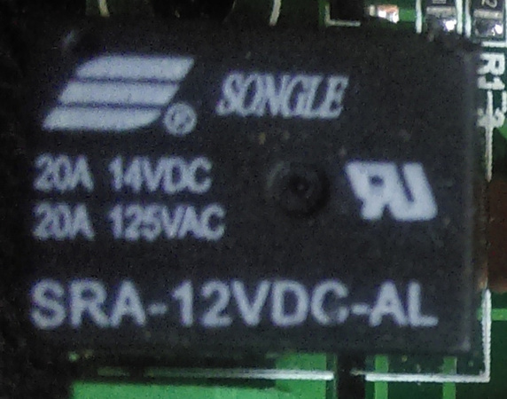

The controller has a bunch of settings that are stored in EEPROM, one of which
is a calibration offset. It turns out that I don't have another thermometer 
capable of any sort of accuracy, so I boiled some water and used 100&#x2103; as
my reference. I had to input an offset of -1.5&#x2103;.

### Slow Cooker

I went out to a couple different thrift stores and didn't find anything to my
liking (ie, nothing cheap enough), but on my way home, I stopped by a yard
sale and found this beauty for $2 cashmoney:

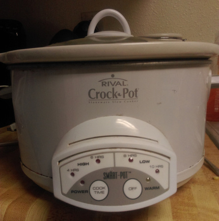

It's got digital controls, so the obvious route of snipping the cord and 
inserting the relay is out of the question, since when the relay cuts power
to the slow cooker, the slow cooker's controller will reset and will not
automatically continue heating when power is restored. No matter- I want this 
to look somewhat less cobbled together than my normal projects, so I have no
problem with some custom integration.

## Build

### Gutting the Slow Cooker

First thing's first- anything 'smart' in the slow cooker has to go. It needs 
to be just a fancy base for a heating element for this to work properly. I can
at least examine how it works as I pull it apart and trash it. 

The PCB is pretty neat- all through-hole  components, with some kind of
controller connected to a triac to power the heating element. I found it
interesting that the controller chip is connected directly to the 120V AC line.
The low-voltage stuff is run off of a voltage divider with a monster cap. You've
gotta cut costs somewhere I guess.

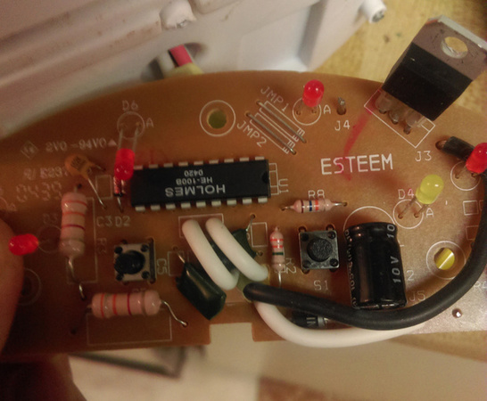

There's what looks like a thermostat connected to the controller. From reading
around, it seems that a lot of slow cookers don't even bother with a 
thermostat- they're just designed with timed on/off cycles for their 
warm/low/high settings. This really was a high-dollar machine.

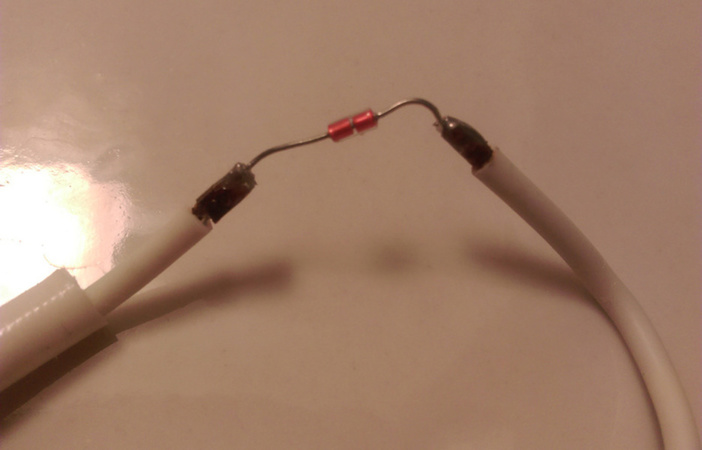

In the end, I was left with just a heating element tied to one leg of the AC input
and the other side with a dangling wire that will be plugged in to the relay.
The other AC leg will be routed to the mounting panel and will be plugged in
to the other side of the relay so when the relay closes, the heating element
will be turned on.

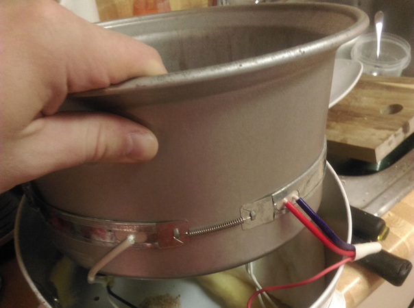

### Prettying Her Up

With the front panel in the trash there was now a really convenient spot to
mount the new temperature controller. Some drill work and a couple of screws
and standoffs later, I've got a professional-looking mount. 

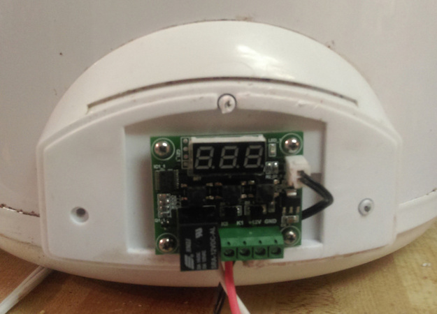

The power for the temperature controller has to come from somewhere, and while
this would have been a great opportunity to rig up a little switching supply...
it's way easier to just pull one from the drawer full of adapters I have. 
Going with the theme of making this not look too much like crap, I ran the
low voltage line alongside the AC line, up into the body of the cooker and
out to the front panel. I tied the cooker's AC line into the switching 
supply's input.

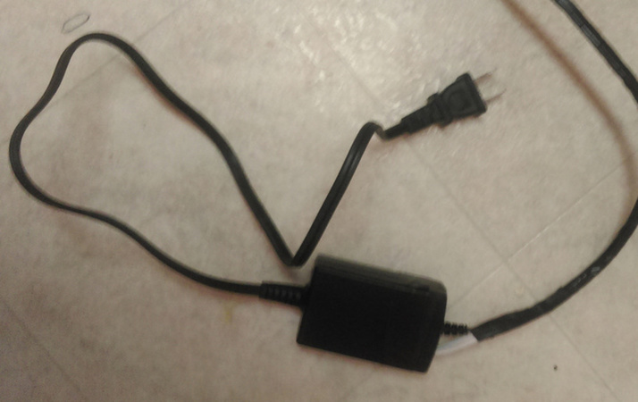

In the end.. it really doesn't look that bad. I routed the temperature probe
up the inside wall so it dangles out of the top, but fits neatly inside the lid.
There's only one cord coming out, and the 'power brick' fits inside the pot
for storage. 

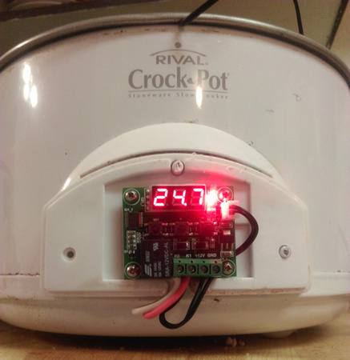

## Testing

The first test was with some water, which, besides the part where nothing
started on fire, wasn't particularly exciting. It was able to maintain the
water temperature to within about 1.5&#x2103;, which is acceptable.

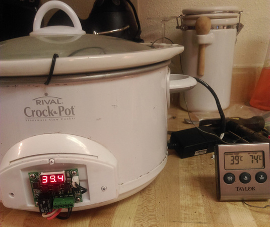

For the second test, I tossed some eggs in there, set it to 73.9&#x2103; (about
165&#x2109;) and let them go for an hour. They came out hard boiled as expected.
I did find that the shell was kind of difficult to remove, even though I did
the 'run them under cold water' trick for about 10 minutes after I pulled them
out.

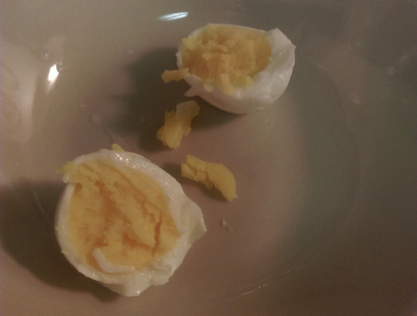

The third test is in progress:

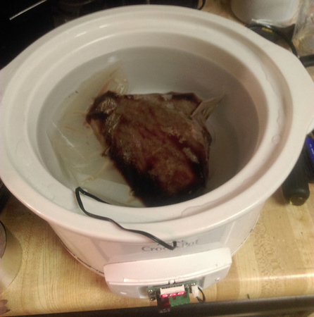

## Conclusion

The [W1209] is a neat little device that's worth every penny of the $2.00 
I spent on it. Though I don't think it could handle precise temperature 
control as-is due to the relay (it would need to be replaced with an SSR or
something quicker and... less mechanical), it's certainly good enough for a
sous-vide setup. I'm excited to start hacking it- the onboard STM8 chip is a 
capable little processor, and I'd like to add some features to it- namely 
heating profiles and some kind of external control/communication interface.

## References

* [[W1209] ebay listing](http://www.ebay.com/itm/201638144120)
* [STM8003F3 Datasheet](http://www.st.com/content/ccc/resource/technical/document/datasheet/42/5a/27/87/ac/5a/44/88/DM00024550.pdf/files/DM00024550.pdf/jcr:content/translations/en.DM00024550.pdf)
* [W1209 break down (in Russian)](http://electrik.info/obzor/968-elektronnyy-termostat-w1209-s-aliekspress.html)
* [Sous-vide Temperature and Timing Chart](http://www.sousvidesupreme.com/sitecm/i/times_and_temps.jpg)

### Extra
[All photos, uncropped](assets/sous-vide-all-photos.zip)
