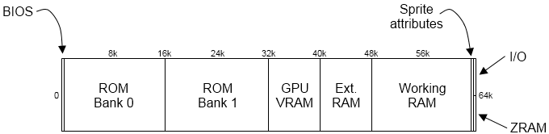

date: 2017-05-29 08:36:52.948560
tags: ''
title: 'Building a Gameboy Clone from Scratch (Part 1: Core Emulation)'

This is part one of a multipart series covering the build of both the hardware
and software necessary to run Nintendo Gameboy games, and hopefully look good
doing it. The goal of this project is to build a complete handheld video game
system similar to the original Nintendo Gameboy (DMG-01), but with some modern
conveniences (backlit display, LiPo battery, save states, etc). Both the 
hardware and software will be developed "from scratch", but that's not to say
that a massive amount of reference material won't be used, especially in 
developing the emulator core.


Part 1 of this series covers the core emulation of the Gameboy's **Sharp 
LR35902 CPU**, which is essentially a modified **Z80**. The **Zilog Z80** was 
designed to be binary-compatible with the **Intel 8080**, but also makes use of
an "extended" instruction set that allows 256 additional instructions. 
I'm not going to go into specifics of the processor or ISA because 
I'm not qualified to do so, especially with the huge amount of resources 
available that already cover the LR35902 and Z80. For the most part, it's 
assumed that the reader is familiar with the general construction and operation
of a microprocessor, so I won't expand on things like the program counter or 
stack operation unless there's some important details specific to the operation
of the LR35902.

CPU
====

Properly emulating the CPU is the most complex part of this project, in my
opinion. At it's base, it seems easy (fetch and execute, what could go wrong?),
but once timing, interrupts, and "unofficial" behavior are added in, it gets
messy fast. In this part, I'm only covering the basic CPU and memory layouts
and saving the more complicated parts for another day.


Register Layout
---------------

The LR35902 has 8 8-bit registers, 7 of which can be accessed directly. They
can also be accessed in pairs using 16-bit operations. The 16-bit operations 
use pairings across the table, ie `AF` or `HL` and are useful for storing 
addresses. `A` and `F` are both special function registers- `A` acts as the 
accumulator and `F` is the flag register. There is also a 16-bit stack pointer
`SP` and a 16-bit program counter `PC`.

<center>**16-bit Register Access**</center>

|   High   |  Low    |
|:--------:|:-------:|
| 15 ... 8 | 7 ... 0 |
|     A    |    F    |
|     B    |    C    |
|     D    |    E    |
|     H    |    L    |


<center>**Flag register layout**</center>

| 7 | 6 | 5 | 4 | 3 | 2 | 1 | 0 |
|---|---|---|---|---|---|---|---|
| Z | N | H | C | x | x | x | x |

| Z: Zero | N: Subtract | H: Half-Carry | C: Carry | x: Not used |
|---------|-------------|---------------|----------|-------------|

On the emulation side, the registers were laid out as a struct, with the 16-bit
pairs accessed through function pointers to getters/setters:

```c
struct Registers_T {
    uint8_t                         a;
    uint8_t                         b;
    uint8_t                         c;
    uint8_t                         d;
    uint8_t                         e;
    uint8_t                         f;
    uint8_t                         h;
    uint8_t                         l;
    uint16_t                  (*af)();
    uint16_t                  (*bc)();
    uint16_t                  (*de)();
    uint16_t                  (*hl)();
    void      (*af_set)(uint16_t val);
    void      (*bc_set)(uint16_t val);
    void      (*de_set)(uint16_t val);
    void      (*hl_set)(uint16_t val);
    uint16_t                       sp;
    uint16_t                       pc;
};
```

I found this to be the best way to organize the registers since it allows 
extra logic in the getter/setter functions (mainly for `AF`):

```c
/* get AF */
static uint16_t af(){
    return ((uint16_t)(reg.a) << 8) | reg.f;
}

/* set AF */
static void af_set(uint16_t val){
    /* The bottom nibble is masked out for f */
    reg.a = (uint8_t)(( val & 0xFF00) >> 8);
    reg.f = (uint8_t)(val & 0x00F0);

    flags.zero_set((reg.f >> 7) & 0x01);
    flags.subtract_set((reg.f >> 6) & 0x01);
    flags.half_carry((reg.f >> 5) & 0x01);
    flags.carry_set((reg.f >>  4) & 0x01);
}

(....)

/* get BC */
static uint16_t bc(){
    return ((uint16_t)(reg.b) << 8) | reg.c;
}

/* set BC */
static void bc_set(uint16_t val){
    reg.b = (uint8_t)( (val & 0xFF00) >> 8);
    reg.c = (uint8_t)(val & 0x00FF);
}

(....)
```

The flags are held in a separate structure with their own getters/setters, 
though the utility of this is debatable. The flag structure also includes
a whole mess of other system flags that are purely for emulation and don't
necessarily have an analog on the LR35902. At this point in the write-up, it 
looks like this:

```c
struct Flags_T {
    uint8_t                  (*carry)();
    uint8_t             (*half_carry)();
    uint8_t               (*subtract)();
    uint8_t                   (*zero)();
    void      (*carry_set)(uint8_t val);
    void (*half_carry_set)(uint8_t val);
    void   (*subtract_set)(uint8_t val);
    void       (*zero_set)(uint8_t val);
    uint8_t                         ime; /* master interrupt enable */
    uint8_t                  alt_cycles; /* use alt cycles (after JP, JR) */
    uint8_t                        halt; /* CPU in HALT mode */
    uint8_t                        stop; /* CPU in STOP mode */
};

(....)

/* get Zero flag */
static uint8_t zero(){
    return (reg.f >> 7) & 0x01;
}

/* set Zero flag */
static void zero_set(uint8_t val){
    reg.f = (reg.f & ~(1 << 7)) | ((val != 0) << 7);
}

(....)
```

The operational flags (zero, carry, etc) have already been explained and here
they are just a copy of what's currently in the `F` register. The `ime` flag
is used to enable interrupts globally (ie, interrupts will not be serviced if
this flag is not set). The `alt_cycles` flag is set when a conditional jump
occurs, as the number of cycles that the operation needs will change. The `halt`
and `stop` flags let the emulator know that the CPU should be in one of those
modes (more on those to come).


Instruction Set
---------------

[=> Complete LR35902 Instruction Set](http://pastraiser.com/cpu/gameboy/gameboy_opcodes.html)

The LR35902 instruction set uses 8-bit opcodes with instructions that vary in
length from 1 to 3 bytes. There are 245 valid instructions in the base set and
256 in the extended set. The extended set is accessed using the `0xCB` opcode,
followed by the extended set opcode. For example `0xCB 0x51` will execute
the `BIT 2,C` operation from the extended instruction set.

With 501 instructions, individually writing functions to emulate each one 
would be incredibly tedious. There's enough shared actions across them, however,
that I was able to write a handful of python scripts to generate most of the
required C code for me. Using the table linked above, along with [another opcode
map](http://imrannazar.com/Gameboy-Z80-Opcode-Map), the python script parsed
the opcode, mnemonic, instruction length, number of cycles, and a description 
of the operation and generated C functions:

```c
/* 0x41 LD B,C; Copy C to B */
void ld_b_c(void){
    reg.b = reg.c;
}
```

I was able to get about 95% coverage after writing around 30 or so regex 
patterns. Common operations, like adding a register to the accumulator or
performing bit operations, were all handled by single general functions:

```c
/* 0x83 ADD A,E; Add E to A */
void add_a_e(void){
    add(reg.e);
}

(....)

/* add to A */
static void add(uint8_t val){
    /* cast as 16-bit as an easy way to check for a carry */
    uint16_t res16 = (uint16_t)reg.a + (uint16_t)val;
    /* set carry if there's anything in the upper byte */
    flags.carry_set((res16 & 0xFF00) != 0);
    /* set the half carry if adding the 1st nibbles overflowed into the 2nd */
    flags.half_carry_set((((reg.a & 0x0F) + (val & 0x0F)) & 0x10) >= 0x10);
    /* add the value to register a*/
    reg.a += val;
    /* set the zero flag if a is now 0 */
    flags.zero_set(reg.a == 0);
    /* reset the subtract/negative flag */
    flags.subtract_set(0);
}
```

Most of the remaining operations were conditional jumps and calls, along with
oddball instructions such as `DAA; Adjust A for BCD Addition`. Of course, 
filling out the remaining operations by hand is where most of the mistakes were
made. All of the organizational stuff that went along with the instruction set
were script-generated as well:

```c
typedef struct {
    uint8_t     opcode;
    char*     mnemonic;
    uint8_t     cycles;
    uint8_t alt_cycles;
    uint8_t     length;
    void      *execute;
} Instruction_T;

Instruction_T base_set[256] = {
    {0x00, "NOP", 4, 0, 1, nop},
    {0x01, "LD BC,0x%04X", 12, 0, 3, ld_bc_nn},
    {0x02, "LD (BC),A", 8, 0, 1, ld_pbc_a},
    (...)
};

```

The array index of each instruction is the same as the opcode, so it's trivial
to decode a newly fetched opcode. With the CPU core complete, the work can move 
on to setting up the memory map so that there's a place to store instructions
waiting to be decoded.

Memory
======

The LR35902 has a 16-bit address bus and a single address space. Most of my
knowledge and experience working with processors at this level comes from 
microcontrollers- mainly AVR's and STM32 chips. Those both have a separate
address space for program memory and SRAM, which essentially makes it impossible
for a program to modify it's own code, since instructions cannot be grabbed 
and executed from SRAM. The Gameboy's single address space allows for some
pretty neat tricks like [programming a game within a game](
http://hackaday.com/2012/11/24/programming-a-game-boy-while-playing-pokemon/). 

The 16-bit bus allows for access to 65,355 locations, with separate sections
mapped to the cartridge ROM/RAM, video RAM, internal RAM, and hardware I/O.
The documentation floating around the internet on emulating the memory set up
varies with respect to naming of each location, but the general map looks 
something like this:


<center>*from Imran Nazar's [GameBoy Emulation in Javascript](
http://imrannazar.com/GameBoy-Emulation-in-JavaScript:-Memory)*</center>

* **0x0000 - 0x3FFF (16,384 bytes) Cartridge ROM** <br/>
    Permanently mapped to the first ROM bank of the currently inserted cartridge
* **0x4000 - 0x7FFF (16,384 bytes) Cartridge ROM Bank n** <br/>
    Mapped to a second ROM bank of the cartridge. If the cartridge has more 
    than 2 banks, there's typically a separate chip within the cartridge that 
    controls which ROM bank this section of memory is mapped to. It can change 
    during execution.
* **0x8000 - 0x9FFF (8,192 bytes) Video RAM**<br/>
    Holds background tile and sprite bitmap data, background tile maps
* **0xA000 - 0xBFFF (8,192 bytes) External RAM**<br/>
    Mapped to external RAM located on the cartridge if available
* **0xC000 - 0xDFFF (8,192 bytes) Working RAM**<br/>
    The on-board RAM of the Gameboy
* **0xE000 - 0xFDFF (7,679 bytes) Copy of Working RAM**<br/>
    Also maps to the on-board RAM of the Gameboy, except the last 512 bytes
* **0xFE00 - 0xFE9F (160 bytes) Sprite Data**<br/>
    Contains position, orientation, and the location of bitmap data for sprites
* **0xFF00 - 0xFF7F (128 bytes) I/O**<br/>
    Mapped to various hardware I/O systems, including the audio processing unit,
    the graphics processing unit, and the buttons/gamepad
* **0xFF80 - 0xFFFF (128 bytes) Zero-page RAM**<br/>
    A block of "high speed" internal RAM

```c
typedef struct{
    uint8_t                          rom0[16384]; /* 16384 bytes */
    uint8_t                          romX[16384]; /* 16384 bytes */
    uint8_t                           vram[8192]; /* 8192 bytes */
    uint8_t                       cart_ram[8192]; /* 8192 bytes */
    uint8_t                           wram[8192]; /* 8192 bytes */
    uint8_t                             oam[160]; /* 160 bytes */
    uint8_t                              io[128]; /* 128 bytes */
    uint8_t                              zp[128]; /* 128 bytes */
    uint8_t                (*get)(uint16_t addr);
    void      (*set)(uint16_t addr, uint8_t val);
} Memory_T;
```

Again, the use of getters/setters will be helpful with memory since there are 
certain sections where reading/writing to them must have some other effect
beyond just storing data. While it will be useful and faster in some cases to
directly write to a block of memory (organized into arrays), **the execution of
instructions will exclusively access the memory through getters and setters so
that that access can be controlled**. For example, it wouldn't make much sense
to allow a game to modify the cartridge ROM, but the emulator will definitely 
need to be allowed to do it at some point if it's ever going to load a program.

The getters are straight-forward- find the array that holds the requested 
address and return the data there. Later, there will need to be a whole mess of 
modifications for the hardware I/O map.

```c
static uint8_t get(uint16_t addr){
    /* cartridge ROM bank 0 */
    if(addr >= 0x0000 && addr <= 0x3FFF){
        return mem.rom0[addr - 0x0000];
    }
    /* cartridge ROM switchable bank */
    else if(addr >= 0x4000 && addr <= 0x7FFF){
        return mem.romX[addr - 0x4000];
    }
    /* video RAM */
    else if(addr >= 0x8000 && addr <= 0x9FFF){
        return mem.vram[addr - 0x8000];
    }
    /* external RAM */
    else if(addr >= 0xA000 && addr <= 0xBFFF){
        return mem.cart_ram[addr - 0xA000];
    }
    /* working/internal RAM */
    else if(addr >= 0xC000 && addr <= 0xDFFF){
        return mem.wram[addr - 0xC000];
    }
    /* copy of working RAM */
    else if(addr >= 0xE000 && addr <= 0xFDFF){
        return mem.wram[addr - 0xC000 - 0x0200];
    }
    /* sprite data, OAM: object attribute mmemory */
    else if(addr >= 0xFE00 && addr <= 0xFE9F){
        return mem.oam[addr - 0xFE00];
    }
    /* unusable memory */
    else if(addr >= 0xFE10 && addr <= 0xFEFF){
        return 0;
    }
    /* hardware I/O - fill this out properly later */
    else if(addr >= 0xFF00 && addr <= 0xFF7F){
        return mem.io[addr - 0xFF00];
    }
    /* zero-page RAM */
    else if(addr >= 0xFF80 && addr <= 0xFFFF){
        return mem.zp[addr - 0xFF80];
    }
}
```

The setters are nearly the same, except addresses that the CPU shouldn't be able
to write to are disregarded. Right now, this seems like a good idea, but later
on it might not work out- especially if there are games that depend on certain
behavior if "unwritable" memory is written to. Again, there's some hand-waving
in the hardware-mapped area that will be filled in later.

```c
static uint8_t set(uint16_t addr, uint8_t val){

    /* The CPU can't change the ROM bank data, so skip 0x0000 - 0x7FFF */
    if(addr >= 0x8000 && addr <= 0x9FFF){
        mem.vram[addr - 0x8000] = val;
    }
    else if(addr >= 0xA000 && addr <= 0xBFFF){
        mem.cart_ram[addr - 0xA000] = val;
    }
    else if(addr >= 0xC000 && addr <= 0xDFFF){
        mem.wram[addr - 0xC000] = val;
    }
    /* copy of Working RAM */
    else if(addr >= 0xE000 && addr <= 0xFDFF){
        mem.wram[addr - 0xC000 - 0x0200] = val;
    }
    else if(addr >= 0xFE00 && addr <= 0xFE9F){
        mem.oam[addr - 0xFE00] = val;
    }
    /* skip unusable memory, 0xFE10 - 0xFEFF */
    /* hardware I/O- again, fill this out properly later */
    else if(addr >= 0xFF00 && addr <= 0xFF7F){
        mem.io[addr - 0xFF00] = val;
    }
    else if(addr >= 0xFF80 && addr <= 0xFFFF){
        mem.zp[addr - 0xFF80] = val;
    }
    else{
        /* address was not in a valid range */
        return;
    }
}
```

Now that there's a working memory system set up, connecting it to the CPU
is pretty straight-forward. It's possible to run some simple test programs
now to make sure everything is wired up correctly. With a little bit of 
tweaking to the hardware I/O, the emulator can even run some ROMs designed to 
test the CPU instructions.

Interfacing
===========

Conceptually, computers are ridiculously simple machines. They know how to do
a certain number of things, and are provided with a list of these things to do
in a certain order. They just keep reading the list and doing these things until
the list runs out (or makes them do the same things over and over forever). 
Connecting the CPU and memory together with a fetch and execute cycle gives us
a way to read and follow that list:

1. Grab the opcode that's stored at the memory address held in the PC register.
2. Increment the PC register
3. Decode the opcode. If it's a multi-byte instruction, keep reading from the
   address held in PC, incrementing it each time, until all the bytes
   needed to execute the instruction have been read.
4. Execute the instruction; each instruction is mapped to a C function.
5. Repeat forever

```c
void cpu_fetch(void){
    /* grab next opcode, increment PC */
    uint8_t opcode = mem.get(reg.pc++);
    /* get instruction data from opcode */
    next_inst = &(base_set[opcode]);

    /* if the opcode is 0xCB, pull the instruction from the extended inst set */
    if(next_inst->opcode == 0xCB){
        next_inst = &(ext_set[mem.get(reg.pc++)]);
        /* all 0xCB instructions have length 1 (not counting the 0xCB) */
        next_operand = 0;
    }
    /* otherwise, get the rest of the instruction based on the length*/
    else{
        if(next_inst->length == 3){
            uint16_t b0 = mem.get(reg.pc++);
            uint16_t b1 = mem.get(reg.pc++);
            next_operand = b1 << 8;
            next_operand |= b0;
        }
        else if(next_inst->length == 2){
            next_operand = (uint16_t)mem.get(reg.pc++);
        }
        else{
            next_operand = 0;
        }
    }
}

void cpu_execute(void){
    /* typecast the operand accordingly and call the pointed-at function */
    if(next_inst->length == 3){
        ((void (*)(uint16_t))(next_inst->execute))((uint16_t)next_operand);
    }
    else if(next_inst->length == 2){
        ((void (*)(uint16_t))(next_inst->execute))((uint8_t)next_operand);
    }
    else if(next_inst->length == 1){
        ((void (*)(void))(next_inst->execute))();
    }
}
```

Simple Testing
--------------

With a fetch-and-execute cycle ready to run, a simple test program can be 
hard-coded then ran while logging the output. The following program should loop 
3 times then set the stop flag, causing the emulator to exit. It will log each
step of the execution to stdout.

```c
uint8_t main(void){
    /* LD A,0x00; load 0x00 into reg A */
    mem.set(0x0000, 0x3E);
    mem.set(0x0001, 0x00);
    /* LD C,0x03; load 0x03 into reg C */
    mem.set(0x0002, 0x0E);
    mem.set(0x0003, 0x03);
    /* DEC C; decrement C */
    mem.set(0x0004, 0x0D);
    /* CP C; compare C with A */
    mem.set(0x0005, 0xB9);
    /* JP NZ,0x004; jump if zero flag isn't set to PC=0x0004 */
    mem.set(0x0006, 0xC2);
    mem.set(0x0007, 0x05);
    mem.set(0x0008, 0x00);
    /* STOP */
    mem.set(0x0009, 0x10);

    /* initialize the program counter to 0 */
    reg.pc = 0x0000;

    /* loop until the stop flag is set (by the STOP instruction) */
    while(!flags.stop){
        /* PC contains the address of the next instruction */
        printf("PC: 0x%04X", reg.pc);
        /* fetch/execute */
        cpu_fetch();
        cpu_execute();
        /* print the results of the execute cycle */
        printf(
            ", AF: 0x%04X, BC: 0x%04X, DE: 0x%04X, HL: 0x%04X, ",
            reg.af(),
            reg.bc(),
            reg.de(),
            reg.hl()
        );
        /* print the mnemonic.. more useful then opcodes in hex */
        printf(next_inst->mnemonic, next_operand);
        printf("\n");
    }

    return 0;
}
```

Compiling and running the emulator produces the expected output, which verifies
that bare-minimum, the fetch/execute cycle works with 1, 2, and 3 byte 
instructions and that the instructions used worked. With 500-something 
instructions however, this method wouldn't work great for thoroughly testing
the entire instruction set.

```
PC: 0x0000, AF: 0x00B0, BC: 0x0013, DE: 0x00D8, HL: 0x014D, LD A,0x00
PC: 0x0002, AF: 0x00B0, BC: 0x0003, DE: 0x00D8, HL: 0x014D, LD C,0x03
PC: 0x0004, AF: 0x0050, BC: 0x0002, DE: 0x00D8, HL: 0x014D, DEC C
PC: 0x0005, AF: 0x0070, BC: 0x0002, DE: 0x00D8, HL: 0x014D, CP C
PC: 0x0006, AF: 0x0070, BC: 0x0002, DE: 0x00D8, HL: 0x014D, JP NZ,0x0004
PC: 0x0004, AF: 0x0050, BC: 0x0001, DE: 0x00D8, HL: 0x014D, DEC C
PC: 0x0005, AF: 0x0070, BC: 0x0001, DE: 0x00D8, HL: 0x014D, CP C
PC: 0x0006, AF: 0x0070, BC: 0x0001, DE: 0x00D8, HL: 0x014D, JP NZ,0x0004
PC: 0x0004, AF: 0x00D0, BC: 0x0000, DE: 0x00D8, HL: 0x014D, DEC C
PC: 0x0005, AF: 0x00C0, BC: 0x0000, DE: 0x00D8, HL: 0x014D, CP C
PC: 0x0006, AF: 0x00C0, BC: 0x0000, DE: 0x00D8, HL: 0x014D, JP NZ,0x0004
PC: 0x0009, AF: 0x00C0, BC: 0x0000, DE: 0x00D8, HL: 0x014D, STOP 0
```

Thorough Testing
================

Since the simple test worked out, it's a good time to move on to some pre-made
test ROMs that were specifically written to test the functionality of the 
CPU. The "test suite" that I used to test my CPU implementation was
[Blargg's tests](http://gbdev.gg8.se/files/roms/blargg-gb-tests/), specifically
the cpu_instr tests. Though there seems to be a large amount of test ROMs
available, Blargg's tests seem to be a standard as far as the basic stuff is
concerned. I was unable to find a batch of test ROMs that focused just on
instruction functionality, and especially not any that would work without 
having implemented graphics yet. Blargg's ROMs output the test results over
the Gameboy's serial link, so with a tiny bit of code on the memory-mapped I/O
lines, test data can be printed to stdout.

The Gameboy serial link data output/input is mapped to `0xFF01`. The next 
address `0xFF02` is used to control the serial link. Writing a byte to `0xFF01`
and then writing `0x81` ( `b10000001` ) will initiate the transfer of that byte.
For the output of the test ROM, "transferring" will print it to stdout.

```c
static uint8_t set(uint16_t addr, uint8_t val){
    (...)   
    /* hardware-mapped memory */
    else if(addr >= 0xFF00 && addr <= 0xFF7F){
        if(addr == 0xFF02 && val == 0x81){
            /* "send" byte from 0xFF01 */
            printf("%c", (char)io[0xFF01 - 0xFF00]);
            /* flush the output buffer */
            fflush(stdout);
        } 
        io[addr - 0xFF00] = val;
    }
    (...)
}
```

Since the system is set up to print the serial data, it should be possible to
load the test ROM into memory and execute it as if it were a Gameboy game.
Before it can actually run though, there's a couple of things that
haven't really been covered yet:

1. The main Gameboy program starts at `0x0100`. At boot-up, everything before
    that address is taken over by the boot ROM (Ninetendo logo scrolling down
    the screen, etc). The instruction at `0x0100` is typically a `NOP` followed
    by a `JP` to a higher address that contains the main routine.
2. The stack pointer is initialized in the boot ROM. The emulator is not 
    currently running the boot ROM, so the SP must be initialized manually.
3. There's no timing at all yet. The fetch-execute cycle will run as fast as
   possible, probably taking up 100% CPU time without something like `usleep`.
4. There are no interrupts yet, so any tests involving them or the `STOP 0` and
    `HALT` instructions will not pass.

```c
uint8_t main(void){

    uint16_t i;
    uint8_t buf[16384];
    FILE *fh;
    /* create a file handle to read in the 10-bit ops.gb test*/ 
    fh = fopen("10-bit ops.gb", "rb");

    /* copy the ROM into memory */
    fread(mem.rom0, 1, 16384, fh);
    fread(mem.romX, 1, 16384, fh);

    /* close the file handle */
    fclose(fh);

    /* initialize the program counter */
    reg.pc = 0x0100;
    /* initialize stack pointer to end of Zero-page RAM */
    reg.sp = 0xFFFE;
    
    /* loop forever, must use ctrl+C, SIGINT to stop */
    while(1)
        /* fetch/execute */
        cpu_fetch();
        cpu_execute();
    }

    return 0;
}
```

If everything goes well, the output will show that the tests passed:

```
$ ./main_rom.elf 
10-bit ops


Passed
```

If something fails, the test will normally print out the opcode of the test
that failed. After intentionally breaking `0xC0 SET 0,B` in the extended 
(CB) instruction set, this is the output:

```
$ ./main_rom.elf 
10-bit ops

CB C0 
Failed
```

Debugging failures is a battle that gets tougher as you go. The first couple are
easy- maybe B didn't get decremented properly, or the stack pointer wasn't
incremented after pushing something on to the stack. Once the low-hanging fruit
is taken care of, it's possible that you'll find tests that have no output at
all because an instruction that they depend on to actually perform the test
is broken. If this happens, you'll have to break out a debugger like [no$gba](
http://problemkaputt.de/gba.htm) or (better) [BGB](http://bgb.bircd.org/) 
(unfortunately I haven't found a purely Linux debugger that matches the 
functionality) and step through both the emulator and the debugger comparing 
registers and memory locations at each step.

With the emulator in it's current state, all of Blargg's tests except one can
be passed. The interrupt instructions test, `02-interrupts.gb` tests that some
of the interrupt service routines (ISRs) are firing. It also tests the HALT
instruction, which relies on interrupts occurring to break out of. Since 
interrupts are tied in with timing, input, and graphics, this final test is
going to have to wait a bit before it's passable.

Next: Graphics
===============

At this point, the core of the LR35902 processor is complete and is capable of
completely decoding and executing every available instruction. Without the rest
of the system, however, it's fairly useless- most games rely on working timing
and interrupts to run. Working graphics are always useful as well. In the next
post, the basics of the GPU will be worked out so at the very least the 
emulator will be able to display the test output on a screen vs outputting to
the console.

References
===========

* [Gameboy Programming Manual (pdf)](www.chrisantonellis.com/files/gameboy/gb-programming-manual.pdf)
* [Gameboy CPU Manual (pdf)](marc.rawer.de/Gameboy/Docs/GBCPUman.pdf)
* [Gameboy CPU (LR35902) instruction set](http://pastraiser.com/cpu/gameboy/gameboy_opcodes.html)
* [RealBoy Emulator Write-up](https://realboyemulator.wordpress.com/2013/01/01/the-nintendo-game-boy-1/)
* [GameBoy Emulation in JavaScript](http://imrannazar.com/GameBoy-Emulation-in-JavaScript)
